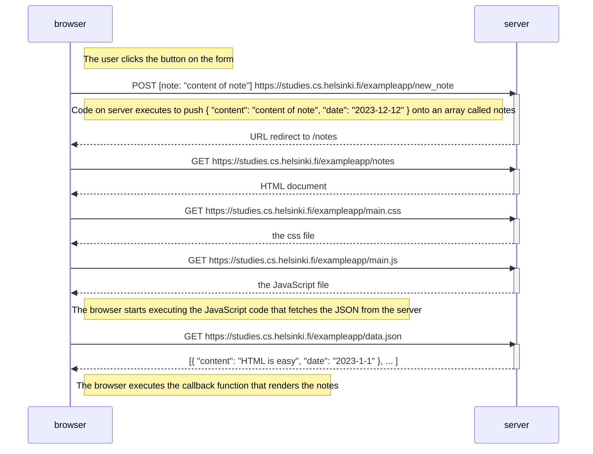

```mermaid
sequenceDiagram
    participant browser
    participant server

    Note right of browser: The user clicks the button on the form

    browser->>server: POST [note: "content of note"] https://studies.cs.helsinki.fi/exampleapp/new_note
    activate server
    Note right of browser: Code on server executes to push { "content": "content of note", "date": "2023-12-12" } onto an array called notes
    server-->>browser: URL redirect to /notes
    deactivate server

    browser->>server: GET https://studies.cs.helsinki.fi/exampleapp/notes
    activate server
    server-->>browser: HTML document
    deactivate server

    browser->>server: GET https://studies.cs.helsinki.fi/exampleapp/main.css
    activate server
    server-->>browser: the css file
    deactivate server

    browser->>server: GET https://studies.cs.helsinki.fi/exampleapp/main.js
    activate server
    server-->>browser: the JavaScript file
    deactivate server

    Note right of browser: The browser starts executing the JavaScript code that fetches the JSON from the server

    browser->>server: GET https://studies.cs.helsinki.fi/exampleapp/data.json
    activate server
    server-->>browser: [{ "content": "HTML is easy", "date": "2023-1-1" }, ... ]
    deactivate server

    Note right of browser: The browser executes the callback function that renders the notes
```
