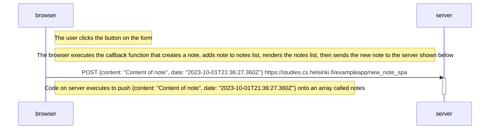

```mermaid
sequenceDiagram
    participant browser
    participant server

    Note right of browser: The user clicks the button on the form

    Note right of browser: The browser executes the callback function that creates a note, adds note to notes list, renders the notes list, then sends the new note to the server shown below

    browser->>server: POST {content: "Content of note", date: "2023-10-01T21:36:27.360Z"} https://studies.cs.helsinki.fi/exampleapp/new_note_spa
    activate server
    Note right of browser: Code on server executes to push {content: "Content of note", date: "2023-10-01T21:36:27.360Z"} onto an array called notes
    deactivate server

    
```
